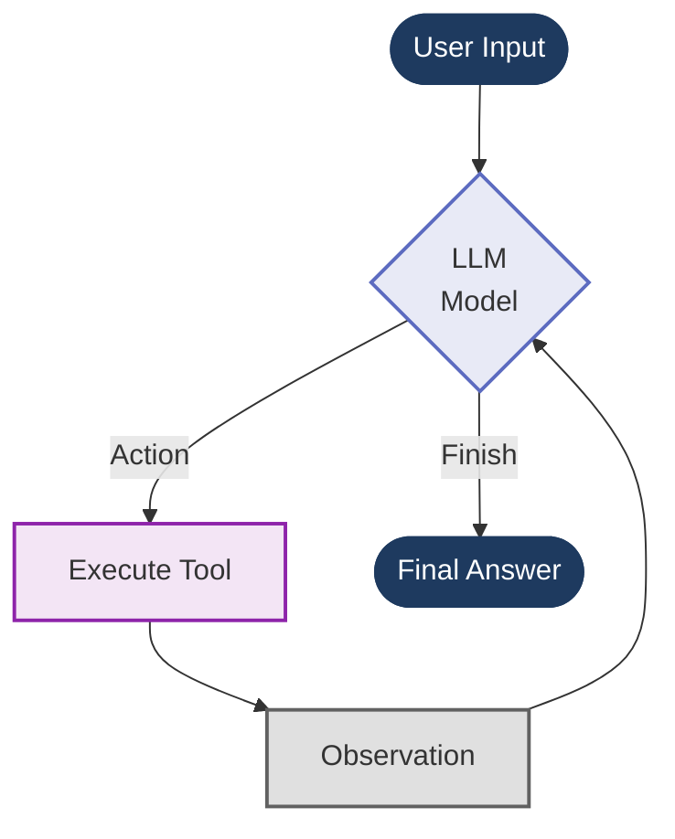
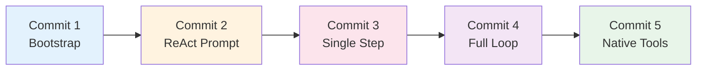

# ReAct Algorithm Tutorial: Building an AI Agent from Scratch

This branch (`project/ReAct-Algo`) is a step-by-step tutorial demonstrating how to build an AI agent using the **ReAct (Reasoning + Acting) algorithm** with LangChain. Each commit represents a distinct stage in the implementation, allowing you to understand the architecture from the ground up.

## What is ReAct?

ReAct (Reasoning + Acting) is a **groundbreaking paradigm introduced by Yao et al. in 2022** that revolutionized how AI agents interact with tools and solve complex tasks. **This is the foundation for all modern AI agents** - from LangChain's agents to OpenAI's Assistants API to Anthropic's tool use. ReAct started it all.

### The ReAct Pattern

The agent iteratively:
1. **Thinks** about what to do next (Reasoning)
2. **Acts** by calling a tool (Acting)
3. **Observes** the result
4. Repeats until it reaches a final answer

This approach enables language models to solve complex tasks by breaking them down into logical steps with tool interactions, creating a transparent "chain of thought" that can be debugged and understood.

### The Original ReAct Prompt

The ReAct paper introduced a specific prompt format that instructs the LLM to alternate between reasoning and acting:

```
Question: [User's question]
Thought: [Agent's reasoning about what to do]
Action: [Tool name to use]
Action Input: [Input for the tool]
Observation: [Result from tool execution]
... (This Thought/Action/Action Input/Observation cycle repeats N times)
Thought: I now know the final answer
Final Answer: [Agent's final response]
```

This structured format forces the model to **think before acting** and to **reason about observations** before taking the next step. It's what makes agents reliable and their decision-making process transparent.



---

## Tutorial Structure

### Commit 1: Bootstrap LangChain ReAct Algorithm Environment
**Commit:** `4c74588`

**What was added:**
- Python 3.11 environment with `uv` package manager
- LangChain dependencies (`langchain`, `langchain-openai`, `langchain-classic`)
- Code formatting tools (black, isort)
- Basic project structure with `main.py` and `get_text_length()` tool stub

**Key concepts:**
- Setting up a modern Python environment for LangChain development
- Creating a simple tool function that will be used by the agent

---

### Commit 2: Add LangChain Tools and ReAct Prompt Template
**Commit:** `4a871d1`

**What was added:**
- Enhanced `get_text_length` tool with the `@tool` decorator
- Complete ReAct prompt template following the standard format:
  ```
  Question -> Thought -> Action -> Action Input -> Observation -> ... -> Final Answer
  ```
- OpenAI LLM initialization with stop tokens (`"\nObservation"`)
- Tool rendering using `render_text_description()`

**Key concepts:**
- The `@tool` decorator transforms functions into LangChain-compatible tools
- The ReAct prompt template guides the LLM through the reasoning loop
- Stop tokens prevent the LLM from hallucinating observations

**Code location:** [main.py:10-50](main.py#L10-L50)

---

### Commit 3: Implement ReAct Agent Step with Tool Execution
**Commit:** `4d2f8b7`

**What was added:**
- `ReActSingleInputOutputParser` to parse LLM output into `AgentAction` or `AgentFinish`
- `find_tool_by_name()` helper function
- Agent chain using LangChain Expression Language (LCEL):
  ```python
  agent = (
      {"input": lambda x: x["input"]}
      | prompt
      | llm
      | ReActSingleInputOutputParser()
  )
  ```
- First execution of a single reasoning step

**Key concepts:**
- `AgentAction`: Represents a tool call (tool name + input)
- `AgentFinish`: Represents the final answer
- The parser extracts structured actions from LLM's textual output
- Tool execution retrieves observations

**Code location:** [main.py:59-89](main.py#L59-L89)

---

### Commit 4: Add ReAct Loop and CallbackHandler for Agent Execution
**Commit:** `5fd2e06`

**What was added:**
- **Full ReAct reasoning loop** using a `while` loop:
  ```python
  while not isinstance(agent_step, AgentFinish):
      # Invoke agent -> Execute tool -> Store observation -> Repeat
  ```
- `intermediate_steps` list to track the agent's scratchpad
- `format_log_to_str()` to format the scratchpad for the prompt
- **`AgentCallbackHandler`** class to log LLM prompts and responses

**Key concepts:**
- The agent scratchpad maintains context across iterations
- The loop continues until the LLM decides it has a final answer
- Callbacks provide visibility into the agent's internal reasoning

**Code location:** [main.py:69-100](main.py#L69-L100), [callbacks.py](callbacks.py)

---

### Commit 5: Switch from ReAct Prompting to Native Tool Calling
**Commit:** `e2a03c3` (current)

**What was changed:**
- **Removed** the manual ReAct prompt template
- **Removed** `ReActSingleInputOutputParser`
- **Replaced** with LangChain's `.bind_tools()` method for native function calling
- Used `HumanMessage` and `ToolMessage` for conversation history
- Simplified agent loop using LLM's built-in tool calling

**Key concepts:**
- Modern LLMs (like GPT-4) have native function calling capabilities
- `.bind_tools()` tells the LLM which tools are available
- The LLM returns structured `tool_calls` instead of textual actions
- This approach is more reliable and easier to maintain than prompt-based ReAct

**Code location:** [main.py:31-69](main.py#L31-L69)

---

## Running the Tutorial

### Prerequisites
```bash
# Install uv (if not already installed)
curl -LsSf https://astral.sh/uv/install.sh | sh

# Set up environment
uv sync
```

### Run the Agent
```bash
python main.py
```

**Example output:**
```
Hello LangChain Tools (.bind_tools)!
***Prompt to LLM was:***
What is the length of the word: DOG
*********
***LLM Response:***
[tool_call: get_text_length]
*********
get_text_length enter with text='DOG'
observation=3
***LLM Response:***
The length of the word "DOG" is 3 characters.
*********
```

---

## Learning Path

To understand the evolution from manual ReAct to native tool calling:

1. **Start at commit `4c74588`** and explore the basic setup
2. **Check out `4a871d1`** to see the ReAct prompt template
3. **Move to `4d2f8b7`** to understand action parsing and tool execution
4. **Study `5fd2e06`** to see the full reasoning loop with scratchpad
5. **End at `e2a03c3`** to see the simplified modern approach

You can check out any commit and run the code:
```bash
git checkout <commit-hash>
python main.py
```

### Architecture Evolution Diagram



**Key Transitions:**
- **1->2**: Added ReAct prompt template and tool decorator
- **2->3**: Implemented action parsing and tool execution
- **3->4**: Added reasoning loop with scratchpad
- **4->5**: Replaced manual prompting with native function calling

---

## Key Takeaways

- **ReAct is the Foundation**: This pattern from 2022 is the basis for ALL modern AI agent frameworks
- **Prompt Engineering Matters**: The original ReAct prompt structure forces structured reasoning
- **Scratchpad**: Maintains intermediate steps to give the agent context across iterations
- **Evolution to Native Tools**: Modern LLMs now have built-in function calling, but the ReAct pattern remains the conceptual foundation
- **Transparency**: ReAct makes agent reasoning visible and debuggable through explicit thought traces
- **LangChain Expression Language (LCEL)**: Enables composable agent chains

---

## Resources

- [LangChain Documentation](https://python.langchain.com/)
- [ReAct Paper (Yao et al., 2022)](https://arxiv.org/abs/2210.03629)
- [OpenAI Function Calling](https://platform.openai.com/docs/guides/function-calling)
